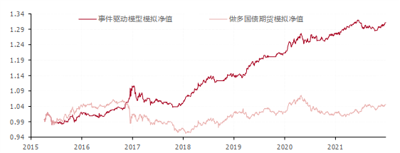
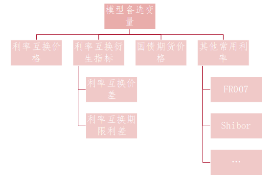

### 尝试搭建利率择时模型的初衷

​	在我浅显的认知中，利率择时可以说是宏观经济永恒的主题，也是最难的领域。因为利率择时不仅需要对宏观经济的精准把握，还需要对国家政策、流动性深入的研究。就拿债券基金来说，在之前中国债券不暴雷的年代，十个债基里有八九个都是做信用下沉的，有些基金经理直接将利率债当做组合的压舱石，买入了就一直持有到期，用来平抑组合的波动。以前这种管理模式可行，是因为信用债和非标资产可以给予组合足够的回报。随着信用债开始逐步暴雷，资管新规开始严格限制非标资产的比例，这些基金经理原先的套路行不通了，开始试图通过其他方式增厚收益。所有打新等固收+产品开始陆续受到追捧。可打新又能帮他们多久呢？个人认为未来一定会有越来越多的投资者开始增加对利率债的投资，利率择时也会被研究的更加透彻。

​	目前市面上多数的券商研报对于利率择时主要通过宏观指标入手将经济划分成复苏、过热、滞涨、衰退，类似于美林时钟，以此对未来利率走势进行预测判断。这种方法的缺陷在于无法很精准的确定目前经济所在的周期，且四个周期的持续时间有时也会显著不同，甚至有时会跨过某个周期直接进入下一个周期。正好本人宏观经济匮乏，所以只能从金工技术分析的角度尝试搭建一个利率择时模型。这个模型没有覆盖宏观指标与政策事件，因此仅可算作是一个起点模型，后续需要更加精细的打磨与调整。

### 模型概况与表现

**多事件驱动的国债期货择时模型最终由三个子事件组成，分别为：**

**子事件**1：FR007 1年期利率互换价格连续10个交易日下降，子事件信号触发后，做多十年国债期货15个交易日；

**子事件**2：O/N Shibor 1年期利率互换价格处于近1个月高位（均值加两倍标准差），子事件信号触发后，做多十年国债期货10个交易日；

**子事件**3：7日定盘回购利率（FR007）处于近1个季度高位（均值加两倍标准差），子事件信号触发后，做空十年国债期货10个交易日。

当多空信号同时触发，或做多 / 做空期间再次触发相反方向的事件信号，以做空信号为准。

整体表现如下：

|     时间区间      | 区间净值 | 年化收益 | 最大回撤 | 资金利用率 |
| :---------------: | :------: | :------: | :------: | :--------: |
| 2015.03 – 2021.12 |  1.312   |  5.42%   |  6.34%   |   84.34%   |

注1：测算时间自2015年3月20日国债期货出现以来开始，年化收益率使用6.75年近似计算。

注2：资金利用效率 = 所有实际做多与做空天数 / 区间总天数。

**模拟净值如下：**

### 变量筛选

#### 模型备选变量选择整体分类与结构

​	在筛选模型备选变量时，我们希望备选指标能拥有以下特点：

1. **尽可能高频**，方便后期对利率走势进行实时的预测与把控。

2. **对国债利率的未来走势有一定领先性与预测能力**。

满足以上两个条件的变量主要以利率衍生品为主。目前我国的利率衍生品主要有国债期货与利率互换两大类。除此以外我们还尝试将其他常用利率加入模型，如7天回购定盘利率（FR007）、Shibor隔夜、Shibor 3个月等。

 

具体来说备选变量主要可以分为四个类型，分别为：

1. **利率互换的价格：**利率互换价格作为市场对参考利率的预期，对参考利率的未来走势有一定的预测作用。

2. **利率互换衍生指标：**利率互换的溢价与不同期限合约的价差一定程度上也可以体现市场对未来利率曲线变化的预期。

3. **国债期货价格：**国债期货的价格更直接与市场对未来国债收益率的预期挂钩，因此国债期货的价格也是重要的备选变量。

4. **其他常用利率：**FR007、O/N Shibor、Shibor 1Y等。

### 单事件效果

具体的如何测算这里就不写了，有兴趣回头可以看报告。这里列举一些效果较好的单事件。

**单事件1：FR007 1Y利率互换价格连续10个交易日下降，事件信号触发后，做多十年国债期货15交易日。**

事件逻辑：该事件本质为利率变化的动量效应。当FR007 1年期利率互换的价格（平滑后）连续10个交易日下跌，表明价格下跌的趋势已经形成，故做多利率实现正收益。

**单事件2：10年国债期货主力连续价格连续5个交易日上涨，事件信号触发后，做多十年国债期货15个交易日。**

事件逻辑：同事件1类似，该事件本质为利率的动量效应。当10年期国债期货价格（主力连续）连续5个交易日上涨，表明利率下降的短期趋势已经形成，故做多国债期货实现正收益。

**单事件3：FR007 6M利率互换价差连续10个交易日升高，做空国债期货10个交易日。**

事件逻辑：互换价差长期保持稳定，因此当互换价差持续提升时，未来较大概率会 恢复至稳定区间。套利者的存在会一定程度上推高利率，故做空国债期货10个交易日。

**单事件4：O/N Shibor 1年期利率互换价格处于近1个月高位。事件信号触发后，做多十年国债期货10个交易日。**

事件逻辑：该事件本质为利率出现短期极值的均值回复过程。当隔1年期隔夜Shibor利率互换价格处于短期1个月的高位时（高于近1个月的均值加两倍标准差），市场看空利率（预计利率未来会升高）的情绪短期内达到峰值，此时往往会在未来短期内出现均值回复的过程。故应在此时短期看多做多10年国债期货。

**单事件5：7天回购定盘利率（FR007）近1个季度处于高位。事件信号触发后，做空十年国债期货10个交易日。**

事件逻辑：该事件属于突破长期状态而形成新常态与趋势的情况。当7天回购定盘利率对长期（1个季度）所处的区间出现了突破，则一定程度说明利率新的长期趋势形成，此时应顺势而为，看空利率，做空国债期货。

### 多事件整合

**1）多个同方向信号（同为做多或同为做空）同时触发：对单个信号的做多/做空区间取并集。若多个同向信号同时触发，或在做多/做空过程中再次触发同向信号，自动延长做多/做空时间至最新的信号对应做多/做空结束时点。**

**2）多个反向信号同时触发（或单事件做多与做空区间出现部分重合）：根据平均回报率决定重合区间做多与做空方向。分别计算全时段所有做多信号日度平均回报率与全时段所有做空信号日度平均回报率。根据结果，选取回报率高的方向对重复区间进行操作。**

### 最终模型结果的讨论

**子事件**1：FR007 1年期利率互换价格连续10个交易日下降，子事件信号触发后，做多十年国债期货15个交易日；

**子事件**2：O/N Shibor 1年期利率互换价格处于近1个月高位（均值加两倍标准差），子事件信号触发后，做多十年国债期货10个交易日；

**子事件**3：7日定盘回购利率（FR007）处于近1个季度高位（均值加两倍标准差），子事件信号触发后，做空十年国债期货10个交易日。

**事件触发侧重点不同：趋势限定条件与极值限定条件。**事件1与事件4相比较，事件1的触发并不受标准差限制，仅注重趋势（10个交易日连续下降）的形成;事件4的触发需超过均值加两倍标准差，所以事件4触发时价格已经处于短期极高的临界位置，大概率均值回复。因此当事件1触发时投资逻辑为趋势投资，当事件4触发时投资逻辑为均值回复。

 

**事件期限结构不同：短期极值均值回复、中长期极值顺势而为。**事件4与事件5的期限结构存在差异，事件4属于短期（1个月）价格处于历史高位，事件5属于中长期（1个季度）价格处于历史高位。由于短期定价更易受到投资者情绪等因素的主导，故短期的极值较大概率出现均值回复的情况。当价格突破了长期以来的波动区间，则说明定价逻辑可能出现改变，新的趋势已经形成。故本模型对期限结构不同的极值事件采取不同的操作增厚收益。

